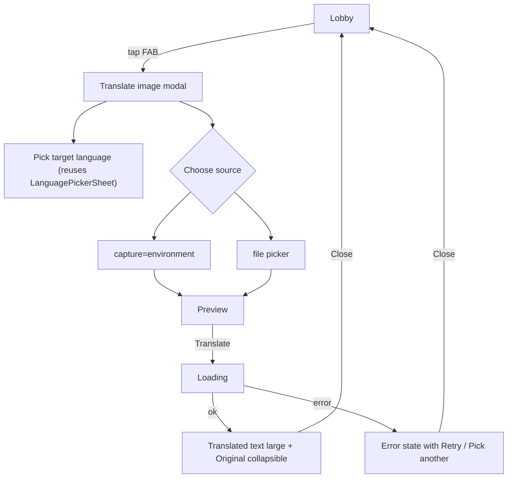

## Scope

Phase 1.6 only: one FAB, one modal, one backend endpoint, no DB, no TTS, no live AR, no batch.

## UX flow



Notes:

- Source language is auto-detected by the model; only target is chosen. Default target = current Lobby `target` so the FAB feels continuous with the rest of the app.
- The modal owns the whole screen on mobile; matches the existing sheet pattern in [frontend/src/components/brand/LanguagePicker.tsx](frontend/src/components/brand/LanguagePicker.tsx) for tone, blur, and `Escape`-to-close behavior.

## Frontend changes

### 1. FAB on Lobby

- Edit [frontend/src/components/screens/Lobby.tsx](frontend/src/components/screens/Lobby.tsx). The existing layout already reserves `padding: "24px 20px 120px"` (bottom 120px) — perfect for a centred bottom FAB without overlapping content.
- Use the agreed FAB visual spec: 72px circle, cyan body, pink halo, navy stroke, layered navy-ring + navy-drop + pink-glow box-shadow. This matches the user-supplied design and carries the same comic/space brand language as the rest of the Lobby.

```tsx
<button
  type="button"
  onClick={() => setCameraOpen(true)}
  aria-label="Translate image with camera"
  style={{
    position: "absolute",
    left: "50%",
    bottom: `calc(env(safe-area-inset-bottom, 0px) + 28px)`,
    transform: "translateX(-50%)",
    width: 72,
    height: 72,
    borderRadius: 999,
    background: ST.cyan,
    border: `4px solid ${ST.pink}`,
    boxShadow: `0 0 0 3px ${ST.navy}, 0 6px 0 0 ${ST.navy}, 0 0 28px rgba(255,62,158,0.55)`,
    cursor: "pointer",
    padding: 0,
    display: "flex",
    alignItems: "center",
    justifyContent: "center",
    zIndex: 50,
  }}
>
  <STIcon name="camera" size={32} color={ST.navy} />
</button>
```

- Positioning: keep `position: absolute` so the FAB pins to the Lobby's own scroll container (the wrapper in [frontend/src/components/screens/Lobby.tsx](frontend/src/components/screens/Lobby.tsx) already has `position: relative`). Wrap `bottom` in `calc(env(safe-area-inset-bottom, 0px) + 28px)` so the supplied 28px default still applies on browsers that report `0` for the inset while iOS/Android home-indicator devices get the extra clearance.
- Use the existing brand tokens `ST.cyan`, `ST.pink`, and `ST.navy` from [frontend/src/components/brand/primitives.tsx](frontend/src/components/brand/primitives.tsx). Avoid introducing the local `ST_CYAN`/`ST_PINK`/`ST_NAVY` constants from the snippet — those duplicate the brand palette and would drift.
- Replace the snippet's `onClick={onLaunch}` and `aria-label="Start video call"` with `onClick={() => setCameraOpen(true)}` and `aria-label="Translate image with camera"`. `onLaunch` is the realtime audio launch path and must stay wired to the existing primary `LAUNCH` button.
- Add an explicit `:focus-visible` outline (3px navy ring offset 2px) since the inline button has no default focus state — required by the user's keyboard-accessibility rule. Apply via a small CSS rule in `frontend/src/styles/tokens.css` or via the existing global class pattern, since inline styles can't express `:focus-visible`.
- Press animation: optional `translateX(-50%) translateY(2px)` with reduced shadow on `:active`, gated by `@media (prefers-reduced-motion: reduce)` to disable. Mirrors `STButton`'s press idiom.

### 2. Icon

- Add a `camera` glyph to `IconName` and `PATHS` in [frontend/src/components/brand/Icons.tsx](frontend/src/components/brand/Icons.tsx). Single SVG path, no new dependency.

### 3. New components under `frontend/src/components/screens/cameraTranslate/`

- `CameraTranslateModal.tsx` — top-level dialog (role="dialog", aria-modal, Escape closes, focus trap minimum: focus first interactive on open and restore on close). Owns step state machine: `idle -> selecting -> previewing -> loading -> result -> error`.
- `CameraCaptureControl.tsx` — two affordances:
  - `<input type="file" accept="image/*" capture="environment">` for camera (mobile triggers system camera; desktop falls back to file picker).
  - Separate "Upload from device" `<input type="file" accept="image/*">` for gallery/disk.
  - No `getUserMedia` / `<video>` element — keeps it simple and avoids permission UX complexity for Phase 1.6.
- `ImagePreview.tsx` — preview with retake/replace and translate buttons.
- `TranslationResult.tsx` — large translated text, detected source language chip (e.g. `STChip` with `globe` icon), `<details>` for original text and copy-to-clipboard.
- `compressImage.ts` — pure helper. Uses canvas:
  - Reads file via `createImageBitmap` (with `` fallback for older browsers).
  - Downscales to max edge 1600px, preserves aspect.
  - Encodes to JPEG quality 0.82 via `canvas.toBlob`.
  - Hard caps output at ~3 MB; if still larger after first pass, re-encode at quality 0.7. If still too large, surface a friendly error.
  - Strips EXIF naturally by virtue of canvas re-encoding (privacy win).
- `cameraTranslateClient.ts` — mirrors [frontend/src/realtimeTokenClient.ts](frontend/src/realtimeTokenClient.ts) pattern: `POST /image/translate` with multipart form-data, Zod-validate response with `imageTranslateResponseSchema` from `@simtalk/shared-types`, normalize errors via `apiErrorSchema`.

### 4. Wiring

- Lobby holds modal-open state and renders `<CameraTranslateModal>` at the bottom of its tree so it sits above the FAB.
- No change to existing session/realtime flows.

## Backend changes

### 1. New endpoint `POST /image/translate`

- New route file `backend/src/routes/imageTranslate.ts`, mounted in [backend/src/app.ts](backend/src/app.ts) behind the same `accessGate` already covering `/realtime/*` and `/rooms/*`.
- Accepts `multipart/form-data` with fields `targetLanguage: string` and `image: File`. Hono supports this via `c.req.parseBody()` — no new dependency.
- Validates with new Zod schemas in [shared/types/src/index.ts](shared/types/src/index.ts):
  - `imageTranslateRequestSchema` (target language tag, MIME whitelist, byte-size cap).
  - `imageTranslateResponseSchema`.
- Server-side limits:
  - Max upload size: 6 MiB (configurable via `IMAGE_TRANSLATE_MAX_BYTES`). Reject early; return `validation_error` with size hint.
  - MIME whitelist: `image/jpeg`, `image/png`, `image/webp`, `image/heic` (browser-supplied; we still trust frontend re-encoding).
  - Returns `Cache-Control: no-store`.
- Rate-limited via existing [backend/src/middleware/rateLimit.ts](backend/src/middleware/rateLimit.ts) — new instance with its own window/cap (e.g. 10 req/min default), configured via `IMAGE_TRANSLATE_RATE_LIMIT_*` env vars to match existing convention.

### 2. Service `backend/src/services/openAiImageTranslate.ts`

- Single function `translateImage({ image, targetLanguage })`.
- Calls the OpenAI Chat Completions / Responses API (whichever the chosen model supports) with the image as a base64 `image_url` data URL or as a file upload, depending on what `gpt-5-nano` accepts at integration time — see Open questions.
- Strict system prompt asking for JSON output:
  ```json
  { "sourceLanguage": "BCP-47", "originalText": "...", "translatedText": "..." }
  ```
- Uses `response_format: { type: "json_object" }` (or equivalent structured output) so we can `JSON.parse` and re-validate with Zod before returning.
- Throws `OpenAiImageTranslateError` mirroring [backend/src/services/openAiRealtime.ts](backend/src/services/openAiRealtime.ts) error pattern (`missing_config | upstream_unavailable | invalid_upstream_response | content_blocked`).
- `AbortController` timeout (e.g. 20s) so a hung upstream doesn't pin the worker.

### 3. Model selection with fallback

- New config in [backend/src/config.ts](backend/src/config.ts):
  - `OPENAI_IMAGE_MODEL_PRIMARY` (default placeholder `gpt-5-nano` — confirm at implementation time).
  - `OPENAI_IMAGE_MODEL_FALLBACK` (default placeholder `gpt-5.4-nano`).
  - `OPENAI_IMAGE_MODEL_REQUEST_TIMEOUT_MS` (default 20_000).
- Strategy: try primary; on `upstream_unavailable`, 5xx, model-not-found, or content-policy-soft-fail, retry once with fallback. Do not retry on validation/auth errors. Log model used (no image content, no transcripts).

### 4. Shared types additions

In [shared/types/src/index.ts](shared/types/src/index.ts):

- `imageTranslateRoute = '/image/translate'`
- `imageTranslateRequestSchema` (multipart fields validated post-parse).
- `imageTranslateResponseSchema = z.object({ sourceLanguage: languageCodeSchema, originalText: z.string(), translatedText: z.string().min(1), modelUsed: z.enum(['primary','fallback']) })`
- Extend `apiErrorCodes` with `content_blocked` and `payload_too_large`.

## Privacy and security

- Image is forwarded to OpenAI in-process only. No disk, no DB, no caching, no logging of image bytes or text. The existing CLAUDE.md invariant ("no server-side persistence of audio, transcripts, or PII") extends to images and OCR output.
- Frontend canvas re-encode strips EXIF (incl. GPS) before upload.
- `OPENAI_API_KEY` stays backend-only — same rule as realtime.
- Security headers, CORS, access gate, and rate limiting reuse existing middleware — no exceptions.
- Response always `Cache-Control: no-store`.
- Validate every cross-boundary payload with Zod from `@simtalk/shared-types`.

## Error states

| Source                           | UI message                                           | Code                                                                 |
| -------------------------------- | ---------------------------------------------------- | -------------------------------------------------------------------- |
| File too large after compression | "Image is too large. Try a smaller photo."           | client-side                                                          |
| Wrong MIME                       | "Unsupported image type."                            | `validation_error`                                                   |
| Network failure / 5xx            | "Couldn't reach the translator. Tap to retry."       | `openai_unavailable`                                                 |
| Both primary and fallback fail   | Same as above; logs distinguish                      | `openai_unavailable`                                                 |
| Content blocked by safety        | "We couldn't translate that image."                  | `content_blocked`                                                    |
| Rate-limited                     | "Too many requests. Wait a moment." with retry-after | `rate_limited`                                                       |
| Missing key in dev               | "Server isn't configured for image translation yet." | `missing_server_config`                                              |
| No text detected                 | "No readable text found in this image."              | empty `originalText` handled as a friendly empty-state, not an error |

Loading state: skeleton shimmer in the modal body, "Translating..." in the result region with an accessible `aria-live="polite"` announcement, Cancel button that aborts the fetch via `AbortController`.

## Implementation sequence

1. Shared types: add route constant, request/response schemas, new error codes. Build `@simtalk/shared-types`.
2. Backend config + service skeleton + route + rate limiter wiring. Stub the OpenAI call behind a feature flag to unblock the frontend.
3. Frontend: `camera` icon, FAB on Lobby, modal state machine, capture-or-upload control, preview, result, error/loading states.
4. `compressImage.ts` helper + client.
5. Wire real OpenAI call with structured JSON output, fallback model retry, and timeout.
6. Manual verification across Safari iOS, Chrome Android, and desktop Chrome/Firefox: capture vs upload, large images, no-text images, offline state, slow network, target language switching, reduced-motion.

## Verification (manual, no new automated tests required by request)

- Tap FAB on Lobby → modal opens, focus moves into the dialog, Escape closes, focus returns to FAB.
- iOS Safari: "capture=environment" opens rear camera; gallery upload also works.
- Image >6 MiB raw is downscaled below cap before upload.
- Network DevTools: only `/image/translate` is called; no third-party requests from the browser; response `Cache-Control: no-store`.
- Forcing primary model to 5xx via local mock causes a single retry against fallback; failing both surfaces friendly error.
- No EXIF GPS in the uploaded payload (re-encoded JPEG).
- `prefers-reduced-motion: reduce` disables FAB hover/press animation but keeps function.

## Open questions / unknowns (call-outs)

1. **Model names.** `gpt-5-nano` / `gpt-5.4-nano` are placeholders from the brief. Confirm the exact OpenAI model identifiers and which API surface they expose images through (Chat Completions `image_url`, Responses API `input_image`, or the Files API) before wiring the service. The config layer is structured so the names are env-only and swappable.
2. **Image size + dimension caps.** OpenAI vision endpoints have per-model image dimension and total-token caps; final compression target (max edge px, JPEG quality, total bytes) should be tuned once the chosen model's published limits are confirmed. Defaults above are conservative.
3. **Browser camera compatibility.** `<input capture="environment">` works on iOS Safari and Android Chrome but is silently ignored on desktop. That's acceptable — desktop users just see a normal file picker. No `getUserMedia` is needed for this phase.
4. **Structured outputs.** If the chosen model doesn't support `response_format: json_object`, fall back to strict prompt + tolerant JSON parser. Either way, validate with Zod before responding.
5. **HEIC support.** Many iPhones default to HEIC; canvas re-encoding to JPEG handles this on iOS Safari but not universally. If we hit a problem we can fall back to sending the original bytes for HEIC and let the model handle it, with a slightly higher size budget.
6. **Access gate behaviour for the FAB.** The endpoint sits behind the existing `accessGate` middleware applied to `/realtime/*` and `/rooms/*`. We'll mount `/image/*` under the same gate so the same password protection covers it. Confirm this matches intent.
