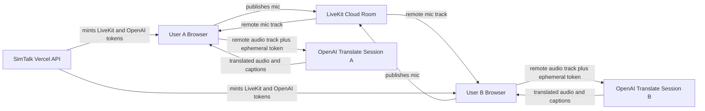

# SimTalk Vercel And Rooms Plan

## 1. Repo Inspection Summary

- The repo is a pnpm workspace with `frontend`, `backend`, and `shared/types` defined in [pnpm-workspace.yaml](pnpm-workspace.yaml).
- Root scripts in [package.json](package.json) already build `@simtalk/shared-types` before backend/frontend for `build`, `typecheck`, `test`, and `test:e2e`.
- There is no `.github/workflows/` directory, no `vercel.json`, and no in-repo deploy config yet.
- There are no `format` or `lint` scripts yet, so the requested CI gates require adding minimal formatting/lint tooling before GitHub Actions can enforce them.
- The backend is currently a long-running Node/Hono service via [backend/src/server.ts](backend/src/server.ts), but the reusable Hono app is already exported from [backend/src/app.ts](backend/src/app.ts), which makes a thin Vercel function adapter practical.
- The frontend defaults API calls to `http://localhost:3000` in [frontend/src/realtimeTokenClient.ts](frontend/src/realtimeTokenClient.ts); deployed Phase 1 should set `VITE_API_BASE_URL=/api`.
- The existing OpenAI flow keeps `OPENAI_API_KEY` server-side in [backend/src/services/openAiRealtime.ts](backend/src/services/openAiRealtime.ts) and returns only short-lived OpenAI realtime client secrets through [backend/src/routes/realtime.ts](backend/src/routes/realtime.ts).
- The current app stores transcript/session state in browser memory and local Blob URLs; there is no server database and no server transcript persistence.
- Current docs still mention `simtalk.app` in [README.md](README.md) and [System_Architecture.md](System_Architecture.md), but this plan treats `simtalk.dev` as the source of truth per your request.

## 2. Step 1: Vercel Deployment Plan

Use one Vercel project for Phase 1:

- Project root: repository root.
- Framework preset: Vite, with explicit monorepo settings.
- Install command: default pnpm install, or `pnpm install --frozen-lockfile` if Vercel does not infer it cleanly.
- Build command: `pnpm --filter @simtalk/shared-types build && pnpm --filter @simtalk/frontend build`.
- Output directory: `frontend/dist`.
- Node version: Node 22.
- Production domain: `simtalk.dev`, with `www.simtalk.dev` redirected to the apex or vice versa after DNS is confirmed.
- API shape: add a thin Vercel function entry under `api/` that mounts the existing Hono `createApp()` under `/api`, preserving backend portability.
- Frontend API base: set `VITE_API_BASE_URL=/api` in Vercel environments.
- Health check: expose `GET /api/health`, with an optional rewrite from `/health` to `/api/health` for operator convenience.
- Password protection: enable Vercel Password Protection for all deployments if the account plan supports protecting the production custom domain. If not supported, this is a deployment blocker because Phase 1 and 1.5 rely on private prototype access.

Deployment flow:

- Disable or bypass automatic Vercel Git deployments if they would deploy before GitHub Actions gates complete.
- Use GitHub Actions with Vercel CLI to deploy preview builds after gates pass on PR branches.
- Use GitHub Actions with `vercel deploy --prebuilt --prod` after gates pass on the production branch.
- Store Vercel deployment credentials only as GitHub repository secrets.
- Use Vercel project env vars for app runtime secrets, not committed files.

Phase 1 assertions to verify after deployment:

- `OPENAI_API_KEY` exists only in Vercel server/function environment variables.
- No `OPENAI_API_KEY`, `LIVEKIT_API_SECRET`, or other server secret uses a `VITE_` prefix.
- Browser responses from `/api/realtime/token` contain only the OpenAI ephemeral client secret, session id, expiry timestamps, and translation call URL.
- The backend never stores audio or transcript data.
- `/api/realtime/token` returns `Cache-Control: no-store`.

## 3. Step 2: Security Plan

Private prototype controls:

- Vercel Password Protection gates the frontend and API because both live under the same deployment.
- A shared tester password is acceptable for Phase 1 and Phase 1.5 only.
- No public signup, no full auth, and no server database are introduced.
- CORS remains strict and should list `https://simtalk.dev` plus the chosen canonical `www` domain if used.
- Same-origin API calls use `/api`; CORS is still useful for blocking unintended browser origins but is not treated as authentication.
- Token routes stay rate-limited. The existing in-memory rate limiter remains a Phase 1 guardrail; Phase 1.5 can add separate limits for LiveKit and OpenAI token minting.
- OpenAI and LiveKit credentials stay server-side only.
- Tokens are short-lived: OpenAI client secret TTL stays low, and LiveKit join tokens should default to about 10 minutes.
- All token responses should use `Cache-Control: no-store`.
- Upstream errors remain sanitized before returning to the browser.
- Backend logs must not include transcript text, audio payloads, OpenAI client secrets, LiveKit participant tokens, or room links with unguessable IDs.

Frontend storage policy:

- Default transcript state remains in memory for Phase 1 and Phase 1.5.
- Use `sessionStorage` only for non-sensitive room UI continuity, such as the current room id, local participant identity, selected output language, and mute preference for reload recovery.
- Avoid `localStorage` for transcripts or room tokens.
- Use IndexedDB only if Phase 1.5 explicitly adds user-controlled local transcript history; document retention and add a clear local delete action before enabling it.
- Recording/download remains local-only and user initiated.

Security headers:

- Keep current API security headers in [backend/src/middleware/securityHeaders.ts](backend/src/middleware/securityHeaders.ts), adjusted if needed for `/api` responses.
- Add Vercel static headers in `vercel.json` for the frontend, including CSP, HSTS, X-Frame-Options or `frame-ancestors`, Referrer-Policy, and X-Content-Type-Options.
- CSP should allow only required connections: self, OpenAI realtime HTTPS endpoints, and Phase 1.5 LiveKit HTTPS/WSS endpoints.
- Because the frontend currently uses inline style props, `style-src` may need `'unsafe-inline'` during the prototype unless styles are migrated.

Acceptable prototype risks:

- Shared password access.
- Shareable unguessable room links behind password protection.
- Best-effort in-memory rate limiting.
- Browser-only transcript state without cross-device persistence.
- No durable audit trail or user attribution.

Not acceptable for production:

- Shared password instead of per-user auth.
- No durable abuse protection.
- No room ownership or invite revocation model.
- No consent/audit model for recordings or transcripts.
- No persistent user preferences or device/session management.

## 4. Step 3: Phase 1.5 Remote Rooms Plan

Default architecture:

Room model:

- Two users only for Phase 1.5.
- Room links use an unguessable random room id in the URL, for example `/rooms/<roomId>`.
- No database is added. The room id itself is the shareable capability, protected by Vercel Password Protection and high entropy.
- Backend validates room id shape, creates or references a LiveKit room, and mints a short-lived LiveKit join token.
- LiveKit rooms should be configured with `maxParticipants: 2`, short `emptyTimeout`, and short `departureTimeout` where supported.
- Each browser stores its own participant identity for the room in `sessionStorage` so reloads can reconnect predictably within the same tab/session.
- Room cleanup is best-effort: stop issuing new short-lived tokens after client-side expiry if implemented, rely on LiveKit empty/departure timeouts, and optionally delete rooms through the LiveKit RoomServiceClient when a user explicitly ends the room.

Audio and translation flow:

- Each participant publishes their microphone to LiveKit.
- Each participant subscribes to the other participant’s original microphone track.
- The local browser sends only the remote participant’s audio track to OpenAI using its own short-lived OpenAI realtime session.
- Each participant chooses their preferred translated output language locally.
- Spoken language input can be collected as an optional hint, but OpenAI auto-detection remains supported.
- The app does not translate a user’s own local microphone back to them.
- Muting original audio should keep the LiveKit track subscribed and set remote audio playback volume to zero, so the track remains available for translation.
- Live captions come from OpenAI transcript deltas and remain browser-only.

Likely implementation units:

- Add shared Zod contracts for LiveKit room creation and token responses in [shared/types/src/index.ts](shared/types/src/index.ts).
- Add backend LiveKit config and service modules under `backend/src/services/` while keeping routes thin.
- Add Hono room/token routes under `backend/src/routes/` mounted from [backend/src/app.ts](backend/src/app.ts).
- Add a frontend LiveKit room client module under `frontend/src/`.
- Refactor [frontend/src/realtimeTranslationSession.ts](frontend/src/realtimeTranslationSession.ts) so an OpenAI translation session can accept either local mic capture or an existing remote `MediaStream`.
- Add room UI components under `frontend/src/components/screens/` without changing existing Listener, Talk, or Practice behavior.
- Add focused backend, shared, frontend unit/component tests under the existing `tests/` structure.

## 5. Step 4: Implementation Sequence

Phase A: deployment readiness and CI foundations.

- Add `format:check`, `format`, and `lint` scripts with minimal repo-wide tooling.
- Add GitHub Actions gates for format, lint, typecheck, tests, build, and mocked Playwright E2E.
- Add Vercel CLI deploy jobs gated behind successful checks.
- Verify root scripts still build shared types before dependent packages.

Phase B: Vercel adapter and static headers.

- Add a thin `api/` Vercel function adapter that mounts the existing Hono app at `/api`.
- Add `vercel.json` for SPA routing, API health rewrite if desired, and frontend security headers.
- Update env examples and README deployment notes to use `simtalk.dev` and `/api`.
- Add tests for the Vercel-mounted route shape if practical without relying on Vercel runtime internals.

Phase C: deploy Phase 1 and manually validate.

- Configure the Vercel project and env vars.
- Configure `simtalk.dev` DNS and Password Protection.
- Deploy a protected preview after CI gates pass.
- Smoke test `/api/health` and `/api/realtime/token` through the protected deployment.
- Promote or deploy production only after browser validation passes.
- Run the browser matrix for Listen, Talk, and Practice modes.

Phase D: LiveKit security and contracts.

- Add LiveKit server-side env vars and validation.
- Add shared request/response schemas for room creation and LiveKit token minting.
- Add backend LiveKit token service using least-privilege grants for `roomJoin`, `canPublish`, and `canSubscribe` scoped to one room.
- Add backend route tests for missing config, invalid room ids, token response shape, cache headers, and rate limiting.

Phase E: Phase 1.5 client room experience.

- Add room creation/link UI.
- Add join room UI with preferred output language and optional spoken language hint.
- Connect to LiveKit from the browser and publish local mic audio.
- Subscribe to the remote participant’s mic track.
- Create a browser-local OpenAI translation session from the remote track.
- Render translated audio and live captions locally.
- Add original-audio mute controls that keep the remote track subscribed.
- Keep transcripts browser-only and document any intentional `sessionStorage` use.

Phase F: Phase 1.5 validation and review.

- Run all CI gates locally.
- Run mocked component/unit tests for room flows.
- Deploy preview after gates pass.
- Browser test two-user rooms on the target devices.
- Review security tradeoffs before production promotion.

## 6. CI/CD Workflow

GitHub Actions should include:

- Checkout repository.
- Setup Node 22.
- Setup pnpm 10 through Corepack or pnpm/action-setup.
- Install dependencies with frozen lockfile.
- Run `pnpm format:check`.
- Run `pnpm lint`.
- Run `pnpm typecheck`.
- Run `pnpm test`.
- Run `pnpm build`.
- Install Playwright Chromium dependencies and run `pnpm test:e2e` for mocked frontend browser coverage.
- For pull requests, deploy a Vercel preview only after gates pass.
- For the production branch, deploy production only after gates pass.

GitHub secrets needed for deployment:

- `VERCEL_TOKEN`.
- `VERCEL_ORG_ID`.
- `VERCEL_PROJECT_ID`.

Deployment commands to plan around:

- `pnpm install --frozen-lockfile`.
- `pnpm format:check`.
- `pnpm lint`.
- `pnpm typecheck`.
- `pnpm test`.
- `pnpm build`.
- `pnpm test:e2e`.
- `pnpm exec vercel pull --yes --environment=preview --token=$VERCEL_TOKEN`.
- `pnpm exec vercel build --token=$VERCEL_TOKEN`.
- `pnpm exec vercel deploy --prebuilt --token=$VERCEL_TOKEN`.
- `pnpm exec vercel pull --yes --environment=production --token=$VERCEL_TOKEN`.
- `pnpm exec vercel deploy --prebuilt --prod --token=$VERCEL_TOKEN`.

## 7. Environment Variables

Existing Phase 1 backend variables:

- `APP_ENV=production`.
- `ALLOWED_ORIGINS=https://simtalk.dev` plus the canonical `www` origin if used.
- `OPENAI_API_KEY`, sensitive, server-side only.
- `OPENAI_REALTIME_CLIENT_SECRET_URL`, usually defaulting to OpenAI’s realtime translations client-secret endpoint.
- `OPENAI_REALTIME_CLIENT_SECRET_TTL_SECONDS`, default `600` or lower for prototype hardening.
- `OPENAI_REALTIME_INPUT_TRANSCRIPTION_MODEL=gpt-realtime-whisper`.
- `REALTIME_TOKEN_RATE_LIMIT_WINDOW_MS=60000`.
- `REALTIME_TOKEN_RATE_LIMIT_MAX_REQUESTS=5` or stricter after browser testing.

Existing Phase 1 frontend variable:

- `VITE_API_BASE_URL=/api`.

Phase 1.5 server-side variables to add:

- `LIVEKIT_URL=wss://<project>.livekit.cloud`.
- `LIVEKIT_API_KEY`, server-side only.
- `LIVEKIT_API_SECRET`, sensitive, server-side only.
- `LIVEKIT_TOKEN_TTL_SECONDS`, suggested `600`.
- `LIVEKIT_ROOM_EMPTY_TIMEOUT_SECONDS`, suggested short prototype value such as `300`.
- `LIVEKIT_ROOM_DEPARTURE_TIMEOUT_SECONDS`, suggested short prototype value such as `60`.
- `ROOM_TOKEN_RATE_LIMIT_WINDOW_MS` and `ROOM_TOKEN_RATE_LIMIT_MAX_REQUESTS`, or reuse a generalized rate-limit config if the code is refactored.

Do not use:

- `VITE_OPENAI_API_KEY`.
- `VITE_LIVEKIT_API_SECRET`.
- Any browser-exposed LiveKit API secret.
- `SESSION_SECRET` for Phase 1.5 unless a real app session is intentionally added later.

## 8. Browser Test Checklist

Browsers/devices:

- Chrome desktop.
- Chrome on iPhone.
- Chrome on iPad.

Phase 1 deployed mode checks:

- Load protected `https://simtalk.dev` and confirm Vercel password gate appears.
- Confirm app loads after shared password entry.
- Confirm microphone permission prompt appears only when starting a session.
- Listen mode: start, hear translated output, see live captions/transcript, pause/end, verify summary/download behavior.
- Talk mode: start, speak side A, flip side, speak side B, confirm correct direction and no stale transcript leakage.
- Practice mode: start with local audio disabled until intended, record/translate practice attempt, end cleanly.
- Confirm no console errors involving missing API URL, CSP blocks, CORS failures, or unhandled WebRTC errors.
- Confirm `/api/health` returns ok through the protected deployment.

Phase 1.5 room checks after implementation:

- User A creates a room and shares the link.
- User B opens the room link behind Vercel password protection.
- Third participant is rejected or cannot join because LiveKit room limit is two.
- Each user selects a different preferred output language.
- Each user hears only the other user translated into their own selected language.
- Neither user hears their own translated voice.
- Original remote audio mute suppresses original audio while translated audio and captions continue.
- Captions appear for translated speech from day one.
- Refresh recovers room identity/preferences from `sessionStorage` where documented.
- Closing/leaving the room stops mic tracks, LiveKit connection, OpenAI session, and audio playback.

## 9. Risks, Decisions, And Open Questions

Decisions already made for this plan:

- Use one Vercel project for Phase 1, with API functions under `/api`.
- Use `simtalk.dev` as the deployment domain.
- Use Vercel Password Protection and a shared password for Phase 1 and Phase 1.5.
- Use browser-local OpenAI translation sessions for remote LiveKit audio in Phase 1.5.
- Do not add full auth or a database.
- Keep transcripts browser-only.

Key risks:

- Vercel Password Protection on the production custom domain may require a paid feature level. If unavailable, deployment should pause before public testing.
- Vercel serverless function behavior may expose weaknesses in the current in-memory rate limiter because instances can reset or scale independently.
- Browser support for taking a remote LiveKit audio track and feeding it into an OpenAI WebRTC session must be validated early with a small technical spike.
- Mobile Chrome on iOS uses WebKit, so microphone, autoplay, and audio route behavior must be tested on real devices.
- LiveKit plus one OpenAI session per listener is simple for two users but can become expensive and complex for groups.
- CSP may need temporary allowance for inline styles because the current UI uses React style props.

Open questions before implementation:

- Confirm the Vercel account plan supports Password Protection for `simtalk.dev` production deployments.
- Choose canonical domain behavior: apex `simtalk.dev` with `www` redirect, or `www.simtalk.dev` with apex redirect.
- Decide whether previews should be available to testers or only production should be shared.
- Decide whether Phase 1.5 should include user-controlled IndexedDB transcript saving, or keep all room transcripts memory-only for the first remote-room release.

## 10. Approval Checkpoint Before Implementation

Do not implement until this plan is reviewed and approved.

After approval, implement in small reviewable phases:

- Start with CI and Vercel adapter only.
- Deploy and browser-test Phase 1 before adding LiveKit.
- Add LiveKit backend token flow and tests.
- Add the two-user room frontend behind the same Vercel protection.
- Run verification after each phase and stop if an invariant is at risk: secrets exposed to browser, server-side transcript persistence, broken Phase 1 modes, or deployment before gates pass.
